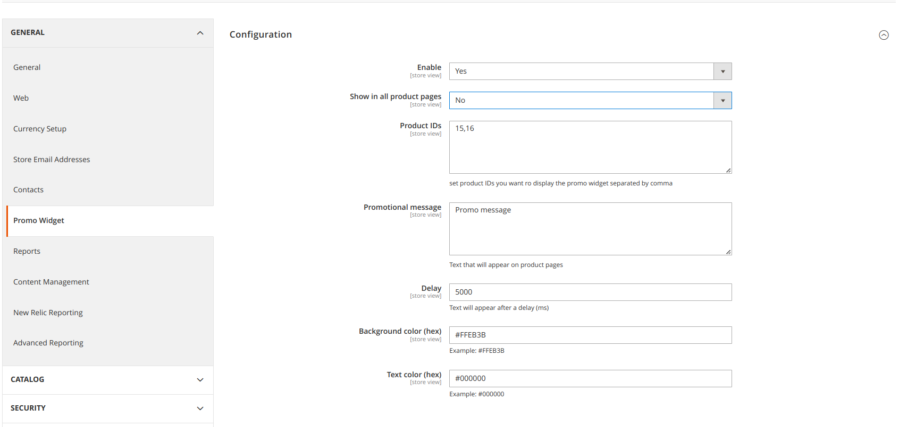
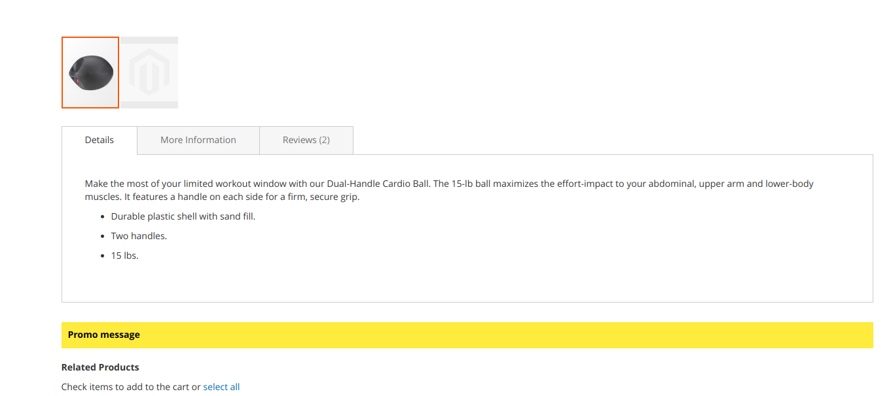

# Candidate_PromoWidget

Magento 2 module that displays a configurable **promotional message** on product detail pages (PDP).  
It is intended as a technical exercise and demonstrates how to create a widget configurable via the Magento admin.

---

## Features

- Display a custom promotional message on PDPs.
- Message content, background color, and text color configurable per **store** scope.
- Option to show:
    - On **all product pages**, or
    - Only on selected product IDs (comma-separated list).
- Appears with a small delay (5s) after page load.

---

## Installation

1. composer require candidate/module-promowidget:dev-main
2. bin/magento setup:upgrade
3. bin/magento cache:flush

